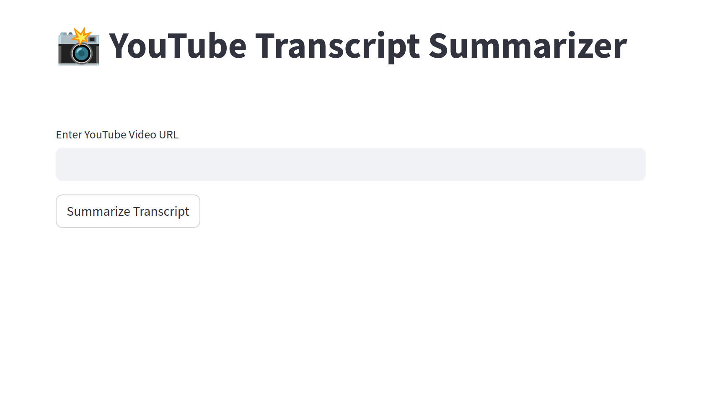

# 📸 YouTube Transcript Summarizer

A Streamlit-based application designed to summarize YouTube video transcripts using a custom prompt template and Gemini API.



## Features

- **YouTube Metadata Extraction**: Extracts video metadata including title, uploader, upload date, duration, and description.
- **Transcript Fetching**: Retrieves and processes transcripts in multiple languages.
- **Customizable Prompt Template**: Allows users to edit the prompt template using Jinja2 syntax.
- **Text Summarization**: Generates concise summaries using a powerful text summarization model.
- **Interactive Logs and Results**: Displays metadata, transcripts, summarization prompts, and summaries in an interactive interface.

## Installation

### Clone the Repository

```bash
git clone https://github.com/your-repo/youtube-transcript-summarizer.git
cd youtube-transcript-summarizer
```

## Install Dependencies

```bash
pip install -r requirements.txt
```

## File Structure

├── assets/\
│ ├── app.png # App screenshot\
├── notebooks/\
│ ├── how_it_works.ipynb # Notebook demonstrating steps involved\
├── templates/\
│ ├── summarization_prompt.jinja # Default Jinja2 template for summarization prompt\
├── utils/\
│ ├── utils.py # Utility functions for the app\
├── app.py # Main Streamlit application\
├── requirements.txt # Python dependencies\
├── README.md # Documentation

## How to Run

1. Set up API Key: Obtain an API key for the gemini-1.5-flash model or compatible API.

2. Start the Streamlit App: Run the following command:

```bash
streamlit run app.py
```

3. Use the App:

- Enter your API key in the sidebar.
- Paste the YouTube video URL in the text input field.
- Click "Summarize Transcript" to process the video and generate the summary.

## Customizing the Prompt Template

The prompt template is written in Jinja2. You can customize it in the sidebar or modify the summarization_prompt.jinja file in the `templates/` directory.

## Acknowledgments

- [YouTube Transcript API](https://github.com/jdepoix/youtube-transcript-api/tree/master) for transcript retrieval.
- [yt-dlp](https://github.com/yt-dlp/yt-dlp) metadata extraction.
- [Jinja2](https://jinja.palletsprojects.com/) for template rendering.
- [Streamlit](https://streamlit.io/) for the app framework.
